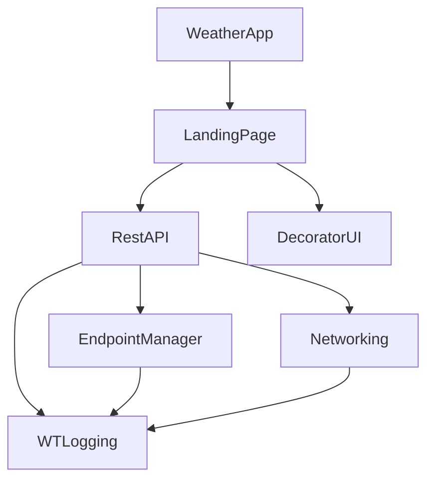

# Weather
The weather iOS app provides free access to weather and geo data. This is a sample project used to apply best practices and keep up to date with modern programming languages.
## Compatibility


## Frameworks


## App Architecture
The weather-tracking app has a single feature component. `Landing Page` is a self-contained feature component with some module dependencies as shown in the graph below.


## Weather app images
| No location selected | Searching loading | Location details | Error handler
| ---- | ---- | ---- | ---- |
|  |  |  |  |

| Searching result | Details |
| ---- | ---- |
|  |  |


### Steps to Run the App


1. Clone the Repository
    - Run the following command in your terminal:
    ```
    git clone git@github.com:mrugama/Weather.git
    ```
2. Open the Project
    - Open the project in Xcode by double-clicking on Weather.xcodeproj.
3. Update Key API
    - Go to the file [EndpointManager](https://github.com/mrugama/Weather/blob/f79f74f70b42f9f3eae7eed950832a32c1bedf3c/WeatherCore/Sources/Foundation/EndpointManager/Implementation/EndpointManager%2BImplementation.swift#L16) and paste your own API key. Please go to [The Weather API documentation](https://www.weatherapi.com/docs/) to get your API Key
4. Run the App
    - Select the desired simulator or device in Xcode.
    - Press the Run button (▶️) or use the shortcut Cmd + R to build and launch the app.

## Test Coverage
